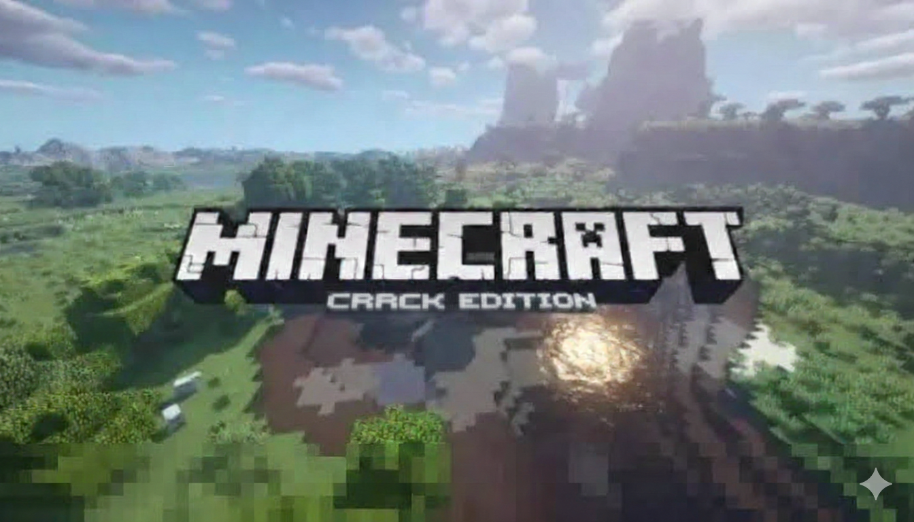

# MCPC Bedrock Bypass Tool




ini hanya untuk bedrok only, java ga bisa 


java krek pake https://tlauncher.org/en/download_1/

Tools CLI sederhana untuk melakukan bypass pada Minecraft Bedrock Edition (Windows 10/11) agar bisa membuka full version.

## ⚠️ Peringatan
- **Matikan Antivirus/Windows Defender** sebelum menjalankan tool ini, karena script akan memodifikasi registry sistem.
- Segala resiko tanggung sendiri (DWYOR).

## Cara Menjalankan (Otomatis)
Buka **PowerShell (Run as Administrator)** dan jalankan perintah berikut:

```powershell
irm https://raw.githubusercontent.com/walkerreza/MCPC_bedrock_bypass_trial/main/minecraft.ps1 | iex
```

## Cara Menjalankan (Manual)
Jika cara otomatis gagal, ikuti langkah ini:

1. Pastikan **Python** sudah terinstall.
2. Download repository ini atau file `terminal_interface.py`.
3. Buka folder tempat file disimpan.
4. Klik kanan pada ruang kosong > "Open in Terminal" / "Open PowerShell window here".
5. Jalankan:
   ```bash
   python terminal_interface.py
   ```

## Fitur
### 1. Unlock Minecraft (New Version)
- **Turn Off Microsoft Antivirus**: Mematikan proteksi Windows Defender (Tamper, Real-time, dll) menggunakan NSudo.
- **Bypass**: Mencari lokasi instalasi Minecraft (C/D) dan menyalin file bypass (`winmm.dll`, dll) secara otomatis.

### 2. Unlock Minecraft (Old Version)
- **IObit Download**: Membantu download IObit Unlocker (Wajib untuk menghapus file sistem DLL).
  > Link Download: [https://iobit-unlocker.softonic-id.com/](https://iobit-unlocker.softonic-id.com/)
- **Bypass with System**: Mengganti file sistem (`Windows.ApplicationModel.Store.dll`) di System32 dan SysWOW64.

## Persyaratan
- Windows 10/11
- Python 3.x
- Koneksi Internet (untuk download NSudo/Script)
- Hak Akses Administrator
